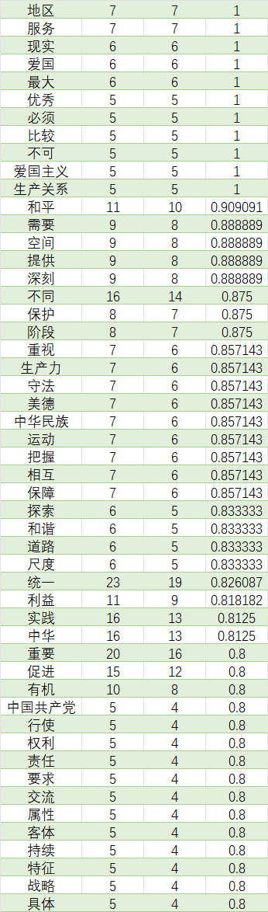
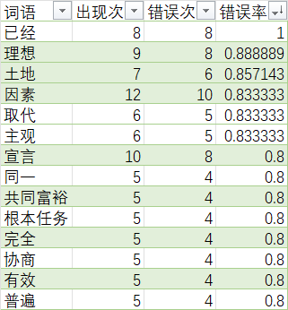

# 考研政治试题大数据分析
## 一、思路来源
XDF（某大牌考研培训机构）一次考研线下讲座，讲师在讲解政治试题时，提到了一种思路：通过分析历年考研政治试题，可以发现一些选项规律，从而可以更好地备考。这种思路给我留下了深刻印象
### 具体方法（机构某老师提出的）
1. 选项中出现XXX，这个选项即正确，选项中出现YYY，这个选项即错误【已完成】
2. 在多选题中，题干中出现XXX全选（好像要分具体的下级学科，如马原、习思等 数据库中预留了该字段）

## 二、数据来源
某小程序抓包，获取了历年考研政治试题，包括真题、模拟题、专项题等，数据量大，但是数据质量参差不齐，需要进行完善，提供json格式数据（在data文件中），提供mysql文件

## 三、文件说明
1. data文件夹：存放数据
2. count.py：统计词频,即思路来源中第二个方法
3. duoxuan_all.py：统计多选题中，题干中出现XXX全选的情况
4. main.py：主程序，数据处理
5. data/XX.json：数据文件,20XX年考研政治真题
6. data/count.csv：词频统计结果
7. data/XXX_cut_list.txt：分词结果

## 四、复现操作
1. 下载本项目
2. 运行main.py
3. 运行count.py
4. 打开data/count.csv查看结果

## 五、分析结果（18-24年）
## 选项中出现该词正确

## 选项中出现该词错误

# 欢迎各位大佬指正或共建此项目
